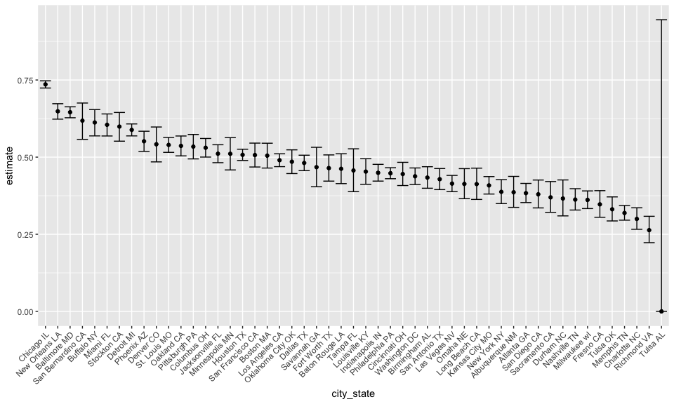

hw5\_sc4456
================
Siyan Chen
11/3/2018

Problem 1
=========

### read all data

``` r
file_list = list.files(path = "./data") 
df = str_c("./data/", file_list) 
# create correct subpath format
new_file_list= str_remove(file_list, "\\.csv$")
# remove .csv 
data_read = data.frame(new_file_list) %>% 
mutate(file_read = map(.x = df, ~read_csv(.x))) %>% 
  unnest()
head(data_read)
```

    ##   new_file_list week_1 week_2 week_3 week_4 week_5 week_6 week_7 week_8
    ## 1        con_01   0.20  -1.31   0.66   1.96   0.23   1.09   0.05   1.94
    ## 2        con_02   1.13  -0.88   1.07   0.17  -0.83  -0.31   1.58   0.44
    ## 3        con_03   1.77   3.11   2.22   3.26   3.31   0.89   1.88   1.01
    ## 4        con_04   1.04   3.66   1.22   2.33   1.47   2.70   1.87   1.66
    ## 5        con_05   0.47  -0.58  -0.09  -1.37  -0.32  -2.17   0.45   0.48
    ## 6        con_06   2.37   2.50   1.59  -0.16   2.08   3.07   0.78   2.35

### tidy data

``` r
tidy_data = data_read %>%
  janitor::clean_names() %>% 
  separate(new_file_list, into = c("group", "subject_id"), sep = "_") %>% 
  gather(key = "week", value = value, week_1:week_8) %>% 
  mutate(subject_id = as.numeric(subject_id), week = str_remove(week, "week\\_")) %>% 
  mutate(week = as.numeric(week), value = as.numeric(value))
head(tidy_data)
```

    ##   group subject_id week value
    ## 1   con          1    1  0.20
    ## 2   con          2    1  1.13
    ## 3   con          3    1  1.77
    ## 4   con          4    1  1.04
    ## 5   con          5    1  0.47
    ## 6   con          6    1  2.37

### Plot

``` r
tidy_data$participants = paste(tidy_data$group, tidy_data$subject_id)
# create a variable to make subject_id unique(control1 is not exp 1)
tidy_data %>% 
  ggplot(aes(x = week, y = value, color = participants)) + geom_line() + facet_grid(~group)
```


Comment: Based on the plot, the subjects of experimental group has slightly higher value at the beginning compared to control. The value of Sunbjects in experimenatl arm increase over weeks while the control group has no trend.

Problem 2
=========

### get dat

``` r
homicide_data = read.csv(text = getURL("https://raw.githubusercontent.com/washingtonpost/data-homicides/master/homicide-data.csv"))
# method I find online to get the data
```

This dataset has 12 variables and 52179 observations. Variables include `city`, `state` `victim age` and others.

### tidy data and summarize about number of homicides

``` r
homicide_data$city_state = paste(homicide_data$city, homicide_data$state) 
# create a new variable 
homicid_data_tidy = homicide_data %>% 
select(-city, -state) %>% 
# and remove the repeated information 
  mutate(disposition = as.character(disposition))
# change to character to detect the string

dfa = homicid_data_tidy %>% 
  group_by(city_state) %>% 
  summarize(total_number = n()) 
# create one dataframe dfa to save city_state and total number of homicide

dfb = homicid_data_tidy %>% 
  mutate(solved = str_detect(homicid_data_tidy$disposition, "Closed by arrest")) %>% 
  group_by(city_state, solved) %>% 
  summarize(number_solved = n()) %>% 
  filter(solved == TRUE)
# get the number of solved homicide for each city

homicide_summarise = merge(dfa, dfb, by = "city_state") %>% 
  mutate(number_unsolved = total_number - number_solved) %>% 
  select(-solved, -number_solved) 
# make a summarize to get the total number of homicide and number of unsolved homicide for each city. 
head(homicide_summarise)
```

    ##       city_state total_number number_unsolved
    ## 1 Albuquerque NM          378             146
    ## 2     Atlanta GA          973             373
    ## 3   Baltimore MD         2827            1825
    ## 4 Baton Rouge LA          424             196
    ## 5  Birmingham AL          800             347
    ## 6      Boston MA          614             310

### prop.test for B city

``` r
Baltimore_MD = homicide_summarise %>% 
  filter(city_state == "Baltimore MD") 
prop_test_Baltimore_MD = prop.test(Baltimore_MD$number_unsolved, Baltimore_MD$total_number)

 prop_test_Baltimore_MD %>% 
   broom::tidy() %>% 
   select(1,5,6)
```

    ## # A tibble: 1 x 3
    ##   estimate conf.low conf.high
    ##      <dbl>    <dbl>     <dbl>
    ## 1    0.646    0.628     0.663

### prop.test for each city

``` r
total_homicide = homicide_summarise %>% 
  select(-3)
unsolved_homicide = homicide_summarise %>% 
  select(-2)
city_prop  = homicide_summarise %>% 
  mutate(parameters = map2(unsolved_homicide$number_unsolved,
                           total_homicide$total_number,
                           prop.test )) %>% 
  mutate(parameters = map(parameters, broom::tidy)) %>% 
  unnest() %>% 
  select(1,4,8,9) %>% 
  janitor::clean_names()
```

    ## Warning in .f(.x[[i]], .y[[i]], ...): Chi-squared approximation may be
    ## incorrect

``` r
head(city_prop)
```

    ##       city_state  estimate  conf_low conf_high
    ## 1 Albuquerque NM 0.3862434 0.3372604 0.4375766
    ## 2     Atlanta GA 0.3833505 0.3528119 0.4148219
    ## 3   Baltimore MD 0.6455607 0.6275625 0.6631599
    ## 4 Baton Rouge LA 0.4622642 0.4141987 0.5110240
    ## 5  Birmingham AL 0.4337500 0.3991889 0.4689557
    ## 6      Boston MA 0.5048860 0.4646219 0.5450881

### plot

``` r
city_prop %>% 
  mutate(city_state = fct_reorder(city_state, desc(estimate))) %>% 
  ggplot(aes(x = city_state, y = estimate)) +
  geom_point() +
  geom_errorbar(aes(ymin = conf_low, ymax = conf_high)) +
  theme(axis.text.x = element_text(angle = 45, hjust = 1))
```



Comment: Tulsa Al looks strange in the plot. Check the data again and found there are two city named Tulsa but with different state. There might be data recording error.
